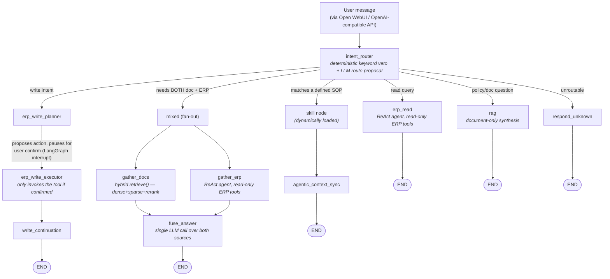

# Youdoo — Vietnamese-Language AI Assistant for Odoo ERP

A conversational agent that lets non-technical staff query and operate an
Odoo ERP system in natural Vietnamese — "does order S00042 meet the SLA?",
"create an invoice for this order", "what's our return policy for damaged
goods?" — instead of navigating Odoo's UI or writing reports.

Built on **LangGraph** with a multi-agent-flavored routing architecture,
served behind an **OpenAI-compatible API** so it plugs into
[Open WebUI](https://openwebui.com/) as just another model.

> **Status:** demo / portfolio project. It runs against a real Odoo
> instance with realistic (not production) data, and every capability
> claim in this README is backed by an eval suite that measures against
> that real instance — not against assumptions about what the ERP
> "probably" returns.

---

## Table of Contents

- [Architecture](#architecture)
- [Why it's structured this way](#why-its-structured-this-way)
- [Engineering practices](#engineering-practices)
- [Known limitations](#known-limitations)
- [Roadmap](#roadmap)
- [Tech stack](#tech-stack)

---

## Architecture

**Routing layer** — `intent_router` combines a fast deterministic
keyword-veto pass with an LLM route proposal. The veto layer exists
because letting an LLM freely decide "is this a write action?" is a
correctness risk a keyword check resolves for free; the LLM layer handles
everything the veto can't. Both layers now live in one named module
(`routing.py`) with a documented two-layer contract, after a refactor that
consolidated what had drifted across four files.

**Fan-out for mixed questions** — some questions need both an internal
policy document *and* live ERP data to answer correctly (e.g. "is this
order still within the return window?" needs the policy's day-count *and*
the order's actual ship date). Rather than answer twice and merge text,
`gather_docs` and `gather_erp` run in the same LangGraph superstep and a
single `fuse_answer` call reasons over both sources together.

**Write path is fail-closed by design, at two independent layers.** Every
write action (create/confirm orders, register payments, etc.) is proposed
by an LLM planner, then confirmation is enforced structurally: the planner
pauses graph execution with a LangGraph interrupt and asks "confirm this?
(yes/no)" — the executor node checks that flag again before invoking any
tool, so a write can't happen without an explicit human "yes" reaching the
graph state, not just a prompt instruction hoping the model asks first.
Separately, the entire write path is also gated by a runtime kill-switch
read from Odoo's own config (`ir.config_parameter`) — toggle it from the
Odoo admin UI, no backend restart needed. If that switch can't be read, or
its value is ambiguous, the system fails **closed** (writes disabled), not
open. This same confirm-before-write guarantee also covers *informal*
write suggestions raised inside a natural-language answer (e.g. a
read-only synthesis step reasoning "this order looks eligible — want me to
confirm it?") — a state-field marker set by the synthesis node and read by
the router carries that suggestion across turns, so a bare "okay" reply
correctly reaches the same interrupt-gated executor instead of falling
through to chitchat and losing context.

**ERP access is read-only by construction**, not by convention: the query
gateway wraps Odoo's XML-RPC surface with an allow-list of business-layer
functions (`sales.py`, `accounting.py`, `inventory.py`, `purchase.py`,
`mrp.py`, `crm.py`), and denies sensitive models like
`ir.config_parameter` outright at the gateway level — the same layer the
write kill-switch above deliberately does *not* route through, so widening
one never widens the other by accident.

**LLM routing is multi-provider and quota-aware.** Seven roles (router,
chitchat, evaluator, planner, read, fusion, synthesis) each resolve
through a provider fallback chain (Google Gemini → Groq → OpenRouter),
with usage tracked in Postgres so budget state survives restarts and
informs fallback decisions.

## Why it's structured this way

A few decisions worth calling out because they were reversed or rejected
based on evidence, not just designed once and left alone:

- **A "supervisor" layer to centralize routing was considered and
  explicitly cancelled.** The two original motivations for it were each
  independently closed by later findings — a retrieval-augmentation idea
  it would have enabled was live-tested and falsified (the failure it
  targeted turned out to be a synthesis bug, not a retrieval gap), and an
  earlier design review had already concluded the deterministic veto
  pattern should be *preserved*, not absorbed into a more centralized
  router. Rather than build a more complex architecture speculatively,
  the routing logic was consolidated into a single well-documented module
  instead.
- **Ollama (local models) was dropped from the chat path in favor of
  cloud APIs**, once it was clear the project's Odoo data is demo data,
  not something requiring on-prem inference for privacy reasons — a
  boundary chosen deliberately, not drifted into.
- **A previous design used one `fusion` node with an agent that pulled in
  ERP context ad hoc.** It was replaced with the explicit fan-out shown
  above after eval measurement showed the old design was architecturally
  blind to whether ERP collection itself was working — a new eval set was
  built specifically to exercise the real collection path, since the old
  one only ever scored a hand-written ERP fixture.
- **A write-confirmation marker was first attached to the LLM message
  object itself, and it was silently non-functional in production despite
  six clean per-task code reviews.** The marker lived in
  `AIMessage.additional_kwargs`; every task's tests constructed that state
  by hand, so none exercised the code path that actually discards it — the
  real per-turn request rebuild keeps only `{role, content}` from
  client-resent history, dropping everything else. Only a final
  whole-branch review that drove a real two-turn conversation through the
  actual entry point caught it. The fix moved the flag into dedicated
  LangGraph state fields (a separate channel the rebuild doesn't touch),
  self-expiring via a message-count anchor instead of requiring every
  terminal node to clear it, then was re-verified against a live backend
  with real Langfuse traces and real ERP data — not just a passing test
  suite.

## Engineering practices

Most of this codebase was built through an agent-driven workflow: a
written spec and implementation plan precede code changes, an independent
review pass checks each change against its plan before it merges, and
prompt/behavior changes are validated with live measurements against the
real ERP and LLM APIs — including A/B-testing candidate prompt wordings
against the eval suite before picking one, not just picking the
better-sounding option. The eval suite itself (`backend/evals/`) is a
first-class part of the repo, not an afterthought: several production bugs
in this README's "known limitations" section were found *because* an eval
set was built to specifically stress a code path that had never been
exercised end-to-end before.

## Known limitations

Listed here because they were found by measurement, not because they're
guesses — each one reflects something the eval suite or a live query
against the real ERP actually surfaced.

- **The demo ERP dataset genuinely lacks some fields a real deployment
  would have.** For example, no order in the demo data has an "urgent
  order" flag, confirmed by querying Odoo's own schema introspection
  (`fields_get`) directly rather than assuming — 117 fields on the sales
  order model, zero related to priority/urgency. Questions that need that
  concept can't be answered correctly by any amount of prompt tuning; it's
  a data gap, not a code gap, and is documented as such rather than
  papered over with a heuristic guess.
- **Tool descriptions can drift from what the underlying function actually
  reads**, and this recurred often enough to earn its own name in the
  project's internal notes ("the fixture asserts a capability the tool
  doesn't have" class of bug). A contract test now checks eval fixtures
  against real tool output for the fields it knows about, but an audit
  found one instance of the same drift **in a production tool
  description** (a price-lookup tool whose LLM-facing description still
  implied customer-specific, discount-applied pricing that the read-only
  ERP gateway cannot actually compute) — tracked as a follow-up rather
  than fixed inline, since correcting it may legitimately change which
  tools the agent chooses to call for related questions.
- **Groundedness/fact-checking currently uses literal-substring allowlist
  matching**, not semantic verification. It's cheap, deterministic, and
  has caught real fabrication bugs, but it can't distinguish "the model
  restated a number in words instead of digits" from "the model made the
  number up" — a small NLI-based fact-checker was scoped as a possible
  upgrade but not built, since the current approach hasn't yet produced
  enough false positives/negatives to justify the added complexity.

## Roadmap

- Fix the production tool-description drift noted above
  (`get_product_price`'s `@tool` description).
- Extend the fixture-vs-real-capability contract test beyond date/status
  fields to cover pricing/discount claims, closing the same detection gap
  that let the issue above go untracked as long as it did.
- **SP-4 (shelved):** a meeting-agent extension — joining a live meeting,
  taking notes, and answering ERP questions in real time. Two open design
  questions are already answered (it should integrate into this agent
  rather than stand alone; Open WebUI already serves as the production
  front-end) but the interaction shape is still open, and the phase is
  blocked on access to real meeting audio to design against.
- Possible quality upgrades identified but not yet scheduled: pinning
  dated model snapshots for API stability, caching eval LLM calls to ease
  free-tier quota pressure during development.

## Tech stack

**Backend:** Python, FastAPI, LangGraph, LangChain
**LLM providers:** Google Gemini, Groq, OpenRouter (multi-provider fallback router)
**Retrieval:** PostgreSQL + pgvector (hybrid dense/sparse + cross-encoder reranking)
**ERP:** Odoo (XML-RPC, read-only gateway with allow-listed business functions)
**Observability:** Langfuse (self-hosted: Postgres, ClickHouse, MinIO, Redis)
**Frontend:** [Open WebUI](https://openwebui.com/) via an OpenAI-compatible `/v1` endpoint
**Testing:** pytest, plus a dedicated eval suite (`backend/evals/`) with a CI gate job (`jobs/eval_gate.py`) that enforces regression thresholds on golden sets
