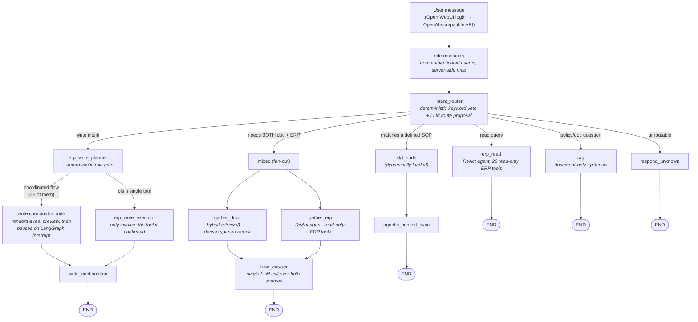

# Youdoo — Vietnamese-Language AI Assistant for Odoo ERP

A conversational agent that lets non-technical staff query and operate an
Odoo ERP system in natural Vietnamese — "does order S00042 meet the SLA?",
"create an invoice for this order", "what's our return policy for damaged
goods?" — instead of navigating Odoo's UI or writing reports.

Built on **LangGraph** with a multi-agent-flavored routing architecture,
served behind an **OpenAI-compatible API** so it plugs into
[Open WebUI](https://openwebui.com/) as just another model. Access is
**role-based end to end**: the role comes from the authenticated login, is
enforced by deterministic code (not a prompt), and is backed by a separate
Odoo account per role.

> **Status:** demo / portfolio project. It runs against a real Odoo
> instance with realistic (not production) data, and every capability
> claim in this README is backed by an eval suite that measures against
> that real instance — not against assumptions about what the ERP
> "probably" returns.

---

## Table of Contents

- [Architecture](#architecture)
- [Role-based access](#role-based-access)
- [Sending email](#sending-email)
- [Why it's structured this way](#why-its-structured-this-way)
- [Engineering practices](#engineering-practices)
- [Known limitations](#known-limitations)
- [Roadmap](#roadmap)
- [Tech stack](#tech-stack)
- [Running it locally](#running-it-locally)

---

## Architecture



**Routing layer** — `intent_router` combines a fast deterministic
keyword-veto pass with an LLM route proposal. The veto layer exists
because letting an LLM freely decide "is this a write action?" is a
correctness risk a keyword check resolves for free; the LLM layer handles
everything the veto can't. Both layers live in one named module
([routing.py](backend/src/agents/routing.py)) with a documented two-layer
contract, after a refactor that consolidated what had drifted across four
files.

**Fan-out for mixed questions** — some questions need both an internal
policy document *and* live ERP data to answer correctly (e.g. "is this
order still within the return window?" needs the policy's day-count *and*
the order's actual ship date). Rather than answer twice and merge text,
`gather_docs` and `gather_erp` run in the same LangGraph superstep and a
single `fuse_answer` call reasons over both sources together.

**Write path is fail-closed by design, at several independent layers.**
Every write action (create/confirm orders, register payments, send
customer email, …) is proposed by an LLM planner, then confirmation is
enforced structurally: the flow pauses graph execution with a LangGraph
interrupt showing a *real* preview built from live ERP data — actual
invoice line items, actual recipient names — and the node checks the
confirm flag again before invoking any tool. A write can't happen without
an explicit human "yes" reaching the graph state, not just a prompt
instruction hoping the model asks first. Separately, the entire write path
is gated by a runtime kill-switch read from Odoo's own config
(`ir.config_parameter`) — toggle it from the Odoo admin UI, no backend
restart needed. If that switch can't be read, or its value is ambiguous,
the system fails **closed** (writes disabled), not open.

The same confirm-before-write guarantee also covers *informal* write
suggestions raised inside a natural-language answer (e.g. a read-only
synthesis step reasoning "this order looks eligible — want me to confirm
it?") — a state-field marker set by the synthesis node and read by the
router carries that suggestion across turns, so a bare "okay" reply
correctly reaches the same interrupt-gated executor instead of falling
through to chitchat and losing context.

**Reads and writes take different paths to Odoo, on purpose.** Reads go
straight from the backend through a query gateway
([erp_query/](backend/src/erp_query/)) that wraps Odoo's XML-RPC surface
with an allow-list of business-layer functions (`sales.py`,
`accounting.py`, `inventory.py`, `purchase.py`, `mrp.py`, `crm.py`),
exposed to the agent as 26 read tools, and denies sensitive models like
`ir.config_parameter` outright at the gateway level. Writes go through a
separate **MCP server process** ([mcp-servers/odoo/](mcp-servers/odoo/))
holding 33 tools. The write kill-switch deliberately does *not* route
through the read gateway, so widening one never widens the other by
accident.

**The MCP write server is hardened independently of the agent**, because
it's a network port with no authentication and one role's write
credential: a deny-by-default XML-RPC method allowlist
([security.py](mcp-servers/odoo/security.py) — a method not in the map is
refused, not passed through), a sliding-window rate limiter, a
sha256 **hash-chained audit log** of every call (`mcp_call_log`, with a
standalone [verify_audit_chain.py](mcp-servers/odoo/verify_audit_chain.py)
checker so tampering with history is detectable), and a default bind of
`127.0.0.1` rather than all interfaces.

**LLM routing is multi-provider and quota-aware.** Seven roles (router,
chitchat, evaluator, planner, read, fusion, synthesis) each resolve
through a provider fallback chain (Google Gemini → Groq → OpenRouter),
with usage tracked in Postgres so budget state survives restarts and
informs fallback decisions.

## Role-based access

Three roles — `admin`, `warehouse`, `accounting` — enforced at three
layers that don't trust each other.

```
Employee logs into Open WebUI            ← real authentication, real password
        │  x-openwebui-user-id (opaque header; name/email are PII, never read)
backend maps user_id → role              ← server-side, user cannot self-declare
        │
picks graph + MCP process + Odoo credential
        │
Odoo enforces its own permission groups  ← last layer, trusts nothing above it
```

A "pick your role from the model dropdown" design was **rejected**: it
lets the user self-declare, which is not authentication. Passing the role
as a *tool argument* was likewise rejected — tool arguments are filled in
by the LLM, the least trustworthy component in the stack.

**Four Odoo accounts, not three, because the read path doesn't go through
MCP.** `ai-readonly` serves the backend's read gateway and the write-gate
check, and holds *zero* write permissions in Odoo — so that path is
read-only because the account cannot write, not because code declines to.
`ai-admin`, `ai-warehouse` and `ai-accounting` each back one MCP process
(`:8003` / `:8004` / `:8005`). Process isolation is the point: the
warehouse process never *holds* the admin credential, so a role-routing
bug degrades to "wrong tool set", not privilege escalation.

**Four permission states, not two.** A real interview with warehouse staff
([role-permission-interview.md](docs/role-permission-interview.md)) showed
that "no" means two different things at a small company — *"my job, but it
needs sign-off"* vs *"another department's job"*. Collapsing them was why
the first design made the warehouse and accounting roles look identical.
So [roles.py](backend/src/agents/roles.py) models `own`,
`needs_sign_off`, `other_dept`, and `denied`, with **unknown tools
defaulting to `denied`** — adding a tool and forgetting to declare it gets
it blocked, not granted to everyone.

**The boundary lives in code, not in the prompt.** An earlier version
asked the LLM to refuse out-of-department requests in words, but the
planner's JSON contract *requires* naming a tool — so the model invented a
tool called `"other"` and the graph dutifully asked the user to "confirm"
a refusal. The refusal is now a deterministic check on `role_cfg.state_of`
in [nodes.py](backend/src/agents/nodes.py), and it checks **the entire
multi-step chain** before anything runs, not just the first step: a
warehouse "deliver this then invoice it" request used to pass the
first-step gate, actually ship the goods, and only get blocked halfway
through. The prompt's department hints survive as *quality* input — they
make the model name the right tool so the refusal can say "that's
Accounting" instead of "another department".

The role also prefixes the LangGraph `thread_id`, so switching roles
mid-conversation can't resume a pending confirmation inside a graph that
no longer contains that node.

> The role → tool mapping itself is deliberately **not** reproduced here.
> It lives in [roles.py](backend/src/agents/roles.py) (per-role sets) and
> [prompts.py](backend/src/agents/prompts.py) (tool → department), and
> hand-copying it into docs is exactly the drift class described under
> [Known limitations](#known-limitations).

## Sending email

The agent sends real email from Odoo at five trigger points (order
confirmation, quotation, RFQ, invoice, delivery), all built from one
parameterized `EmailCfg` factory rather than five near-copies.

Two things about this were harder than they look:

- **Rendering a template is itself a write.** Odoo won't render a mail
  template over XML-RPC without creating a `mail.mail` record. So the
  "preview" step can't sit before the confirmation interrupt in a single
  node — LangGraph replays the whole node on resume, and a probe measured
  exactly that: preview ran twice, two draft records existed, and the mail
  actually sent was *not* the one the user approved. The flow is split
  into two nodes so the completed preview node is a checkpoint boundary.
  The second node re-checks the write kill-switch itself, since splitting
  the node silently removed the free re-check that replay had been
  providing.
- **The draft is inert from the moment it exists.** `preview_template_email`
  creates the record directly at `state='cancel'` (via `send_mail`'s
  `email_values`), verified against Odoo's own source: both the hourly
  "Mail: Email Queue Manager" cron and `mail.mail._send()` only touch
  `state='outgoing'` records. An abandoned confirmation therefore can't be
  swept up and mailed an hour later. Discarding a rejected draft is now
  just cleanup, not a safety mechanism.

Mail scope is enforced per role inside the MCP process too
([role_scope.py](mcp-servers/odoo/role_scope.py)) plus an Odoo `ir.rule`,
so the backend's tool filter isn't the only thing standing between a role
and someone else's templates.

## Why it's structured this way

A few decisions worth calling out because they were reversed or rejected
based on evidence, not just designed once and left alone:

- **A "supervisor" layer to centralize routing was considered and
  explicitly cancelled.** The two original motivations for it were each
  independently closed by later findings — a retrieval-augmentation idea
  it would have enabled was live-tested and falsified (the failure it
  targeted turned out to be a synthesis bug, not a retrieval gap), and an
  earlier design review had already concluded the deterministic veto
  pattern should be *preserved*, not absorbed into a more centralized
  router. Rather than build a more complex architecture speculatively,
  the routing logic was consolidated into a single well-documented module
  instead.
- **A capability survey measured the ERP instead of guessing at it, and
  killed its own proposal.** The feature it set out to design was called
  "my work today"; querying the live instance found that **91 of 94**
  pending warehouse transfers have no assignee at all, so filtering by
  "mine" would have shown a warehouse worker one item instead of 94. The
  useful axis there is time and document type, not ownership. The same
  survey found the real gap: 33 write tools but every read tool is a
  lookup-by-name — `log_activity` *writes* to a to-do list that no tool
  can read back, and all 37 activities in the system are overdue. Full
  numbers in [ADR-012](docs/ADR-012-agent-capability-and-permissions.md).
- **Ollama (local models) was dropped from the chat path in favor of
  cloud APIs**, once it was clear the project's Odoo data is demo data,
  not something requiring on-prem inference for privacy reasons — a
  boundary chosen deliberately, not drifted into.
- **RAG's separate Ollama instance (embeddings only, `bge-m3`) was shared
  with a sibling repo on the same dev machine, then deliberately
  un-shared.** Youdoo forked from an earlier project that runs its own
  Docker stack including an Ollama instance already serving `bge-m3`;
  reusing it looked free — no business data to isolate, no extra disk/VRAM.
  A live test surfaced the cost that reasoning missed: when the sibling
  project's stack wasn't running, Youdoo's RAG broke, and in the `mixed`
  fan-out path the failure was silently absorbed by `fuse_answer` and
  answered as if it were a legitimate "policy doesn't cover this" business
  response — indistinguishable from a real gap (see Known limitations).
  Youdoo now runs its own CPU-only `ollama` container — deliberately not
  competing for the sibling project's GPU — independently verified to
  serve byte-identical `bge-m3` weights (matching model digest) so no
  re-ingest of the existing RAG corpus was needed.
- **A previous design used one `fusion` node with an agent that pulled in
  ERP context ad hoc.** It was replaced with the explicit fan-out shown
  above after eval measurement showed the old design was architecturally
  blind to whether ERP collection itself was working — a new eval set was
  built specifically to exercise the real collection path, since the old
  one only ever scored a hand-written ERP fixture.
- **A write-confirmation marker was first attached to the LLM message
  object itself, and it was silently non-functional in production despite
  six clean per-task code reviews.** The marker lived in
  `AIMessage.additional_kwargs`; every task's tests constructed that state
  by hand, so none exercised the code path that actually discards it — the
  real per-turn request rebuild keeps only `{role, content}` from
  client-resent history, dropping everything else. Only a final
  whole-branch review that drove a real two-turn conversation through the
  actual entry point caught it. The fix moved the flag into dedicated
  LangGraph state fields (a separate channel the rebuild doesn't touch),
  self-expiring via a message-count anchor instead of requiring every
  terminal node to clear it, then was re-verified against a live backend
  with real Langfuse traces and real ERP data — not just a passing test
  suite.

## Engineering practices

Most of this codebase was built through an agent-driven workflow: a
written spec and implementation plan precede code changes, an independent
review pass checks each change against its plan before it merges, and
prompt/behavior changes are validated with live measurements against the
real ERP and LLM APIs — including A/B-testing candidate prompt wordings
against the eval suite before picking one, not just picking the
better-sounding option.

Two habits earned their place by catching things reviews didn't:

- **Live-verify against the branch's own worktree before merging,** not
  after. Several defects reached "all reviews clean, 1,300+ tests green"
  and were still caught only by driving the real entry point against real
  Odoo — including an Odoo `auto_delete` crash in the email path, and a
  round where *every* mail tool was dead for both non-admin roles while
  the suite stayed entirely green.
- **Measure claims, including my own.** Three claims in one internal
  report were corrected by measurement rather than argument; one of those
  corrections found that the verification script's own lookup table had
  8 of 18 rows wrong, which meant a previously reported "2 broken tools"
  was really 1.

The eval suite ([backend/evals/](backend/evals/)) is a first-class part of
the repo, not an afterthought: several production bugs in this README's
"known limitations" section were found *because* an eval set was built to
specifically stress a code path that had never been exercised end-to-end
before. A CI gate job ([jobs/eval_gate.py](backend/jobs/eval_gate.py))
enforces regression thresholds on the golden sets.

## Known limitations

Listed here because they were found by measurement, not because they're
guesses — each one reflects something the eval suite or a live query
against the real ERP actually surfaced.

- **Hand-declared lists drift from the truth they describe, silently,
  while tests stay green.** This has now recurred **five** times in this
  codebase and is tracked as its own bug class. Instances: an eval fixture
  asserting a capability the tool didn't have; a metric's hardcoded tool
  list that omitted the four mail tools, making the "dangerous misroute"
  score blind to exactly the tools that send mail outside the company; a
  coordinator dependency set; a tool → department table that had fallen
  three tools behind the role config it's supposed to be the single source
  for; and a hand-copied tool → Odoo-model table in the consistency
  checker measured at **8 of 18 rows wrong**. The last two are being
  closed now by deriving one from the other instead of declaring both
  ([design](docs/superpowers/specs/2026-08-12-role-declaration-derivation-design.md)).
  The pattern in every case: the list and the truth are edited by
  different changes, and nothing fails when they disagree.
- **The demo ERP dataset genuinely lacks some fields a real deployment
  would have.** For example, no order in the demo data has an "urgent
  order" flag, confirmed by querying Odoo's own schema introspection
  (`fields_get`) directly rather than assuming — 117 fields on the sales
  order model, zero related to priority/urgency. Questions that need that
  concept can't be answered correctly by any amount of prompt tuning; it's
  a data gap, not a code gap, and is documented as such rather than
  papered over with a heuristic guess.
- **Tool descriptions can drift from what the underlying function actually
  reads.** A contract test now checks eval fixtures against real tool
  output for the fields it knows about, but an audit found one instance of
  the same drift **in a production tool description** (a price-lookup tool
  whose LLM-facing description still implied customer-specific,
  discount-applied pricing that the read-only ERP gateway cannot actually
  compute) — tracked as a follow-up rather than fixed inline, since
  correcting it may legitimately change which tools the agent chooses to
  call for related questions.
- **The out-of-department refusal reads wrong for one profile.** Under the
  `enterprise` policy profile, a few operations (inventory adjustment,
  scrapping, returns) move outside the warehouse role while still being
  *warehouse work* — so the refusal says "not within the Warehouse
  department's authority, please contact the Warehouse department." Saying
  it correctly needs a different message ("this requires manager
  sign-off") and a real approval flow, which is deferred; the current
  behavior is knowingly left as-is rather than made worse.
- **Groundedness/fact-checking currently uses literal-substring allowlist
  matching**, not semantic verification. It's cheap, deterministic, and
  has caught real fabrication bugs, but it can't distinguish "the model
  restated a number in words instead of digits" from "the model made the
  number up" — a small NLI-based fact-checker was scoped as a possible
  upgrade but not built, since the current approach hasn't yet produced
  enough false positives/negatives to justify the added complexity.
- **A failed document-retrieval step can still be answered as if it were a
  legitimate "not covered by policy" response, not surfaced as an error.**
  In the `mixed` fan-out path, `fuse_answer` synthesizes over ERP and
  document results in a single LLM call; if `gather_docs` comes back empty
  because retrieval itself failed (embedding service unreachable, corpus
  never ingested, etc.), the synthesis step has no signal telling it "the
  document half failed" versus "the document genuinely doesn't cover
  this," so it produces the same style of sentence either way. The
  pure-`rag` route degrades loudly with an explicit error message; `mixed`
  does not — confirmed by live-testing the identical underlying failure
  through both routes side by side. Isolating the RAG embedding
  infrastructure (see "Why it's structured this way") makes this failure
  rarer, not impossible, and doesn't close the gap on its own.
- **A shared read credential means every role can read everything.** A
  deliberate trade-off matching the business reality (warehouse staff need
  to know whether an order is paid before shipping it), and reversible —
  every `erp_query` function already accepts an injectable gateway, so
  per-role read gateways are a change, not a rewrite.

## Roadmap

- Finish deriving the department table and the tool → Odoo-model table
  from single sources, closing the two remaining instances of the
  hand-declared-list drift class above.
- Give the agent a way to *read* the work queue, not just write to it —
  the survey's sharpest finding was 94 pending transfers and 37 overdue
  activities that no read tool can surface. This is the "Send button with
  no Inbox" gap.
- Cross-department handoff via Odoo activities rather than a dead-end
  refusal. Activities attach to the record, carry an owner and a due date,
  and close; internal mail does none of that. `log_activity` is now general
  (any model, any Odoo-declared type, any recipient) — that blocker is
  closed. The remaining blocker is an intent-router defect: the accounting
  role loads no SOP skill, so its worker block renders empty, and an empty
  worker block makes the router classify write requests as `unknown` — the
  planner never runs, so the deterministic guard has nothing to catch
  (measured 2026-08-12).
- An approval flow for the `needs_sign_off` state, which currently exists
  in the policy model but has no runtime behavior of its own.
- Fix the production tool-description drift noted above
  (`get_product_price`'s `@tool` description), and extend the
  fixture-vs-real-capability contract test beyond date/status fields to
  cover pricing/discount claims.
- Make `fuse_answer` distinguish "document retrieval failed" from
  "document search found nothing relevant" in the `mixed` path.
- **SP-4 (shelved):** a meeting-agent extension — joining a live meeting,
  taking notes, and answering ERP questions in real time. Two open design
  questions are already answered (it should integrate into this agent
  rather than stand alone; Open WebUI already serves as the production
  front-end) but the interaction shape is still open, and the phase is
  blocked on access to real meeting audio to design against.
- Possible quality upgrades identified but not yet scheduled: pinning
  dated model snapshots for API stability, caching eval LLM calls to ease
  free-tier quota pressure during development.

## Tech stack

**Backend:** Python 3.11, FastAPI, LangGraph, LangChain
**LLM providers:** Google Gemini, Groq, OpenRouter (multi-provider fallback router)
**Retrieval:** PostgreSQL + pgvector (hybrid dense/sparse + cross-encoder reranking), embeddings via a dedicated self-hosted Ollama (`bge-m3`)
**ERP reads:** Odoo XML-RPC through a read-only gateway with allow-listed business functions, 26 agent-facing tools
**ERP writes:** a separate MCP server (33 tools) run as three role-isolated processes, with a deny-by-default method allowlist, rate limiting, and a hash-chained audit log
**Observability:** Langfuse (self-hosted: Postgres, ClickHouse, MinIO, Redis)
**Frontend:** [Open WebUI](https://openwebui.com/) via an OpenAI-compatible `/v1` endpoint
**Testing:** pytest (1,339 tests), plus a dedicated eval suite ([backend/evals/](backend/evals/)) with a CI gate job ([jobs/eval_gate.py](backend/jobs/eval_gate.py)) that enforces regression thresholds on golden sets

## Running it locally

Full walkthrough — including the four Odoo AI accounts, the three MCP
processes, and the `.env` keys role-based access needs — is in
[docs/getting-started.md](docs/getting-started.md). Every step there was
run against a real backend and real Odoo while it was written.

The short version:

```powershell
# Postgres, Ollama, Open WebUI (add --profile observability for Langfuse)
docker compose up -d

# one-time: create the 4 AI accounts + permission groups in Odoo
backend\.venv\Scripts\python.exe scripts\odoo_setup_ai_accounts.py

# backend (:8002) + all three mcp-odoo processes (:8003/:8004/:8005)
.\start-dev.ps1
```

Then open Open WebUI and pick the `erp-assistant` model.

| Service | Host port |
|---|---|
| Backend (`/v1`) | 8002 |
| mcp-odoo — admin / warehouse / accounting | 8003 / 8004 / 8005 |
| Open WebUI | 3002 |
| Langfuse | 3001 |
| Postgres | 5434 |
| Ollama (embeddings) | 11435 |

Non-default ports throughout: this repo shares a dev machine with a
sibling project, and each collision was resolved by moving *this* project,
not the one already running with real data.
