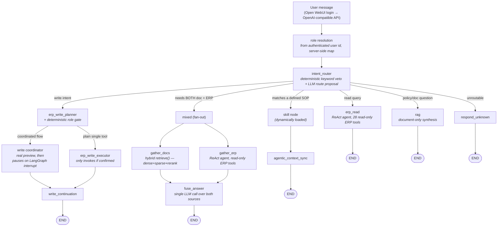

# Youdoo — Vietnamese-Language AI Assistant for Odoo ERP

A conversational agent that lets non-technical staff query and operate an Odoo ERP
in natural Vietnamese — *"does order S00042 meet the SLA?"*, *"create an invoice
for this order"*, *"what's our return policy for damaged goods?"* — instead of
navigating Odoo's UI or writing reports.

Built on **LangGraph**, served behind an **OpenAI-compatible API** so it plugs into
[Open WebUI](https://openwebui.com/) as just another model. Access is **role-based
end to end**: the role comes from the authenticated login, is enforced by
deterministic code (not a prompt), and is backed by a separate Odoo account per
role.

> **Status:** demo / portfolio project, running against a real Odoo instance with
> realistic (not production) data. Every capability claim here is backed by an eval
> suite measuring against that instance — not by assumptions about what the ERP
> "probably" returns.

## Architecture



**Routing.** A deterministic keyword veto runs before the LLM route proposal:
letting a model freely decide *"is this a write action?"* is a correctness risk a
keyword check resolves for free. Both layers live in one module with a documented
contract ([routing.py](backend/src/agents/routing.py)), after a refactor that
consolidated what had drifted across four files.

**Fan-out for mixed questions.** *"Is this order still within the return window?"*
needs the policy's day-count *and* the order's ship date. Rather than answer twice
and merge text, `gather_docs` and `gather_erp` run in the same LangGraph superstep
and one `fuse_answer` call reasons over both.

**The write path is fail-closed at several independent layers.** Confirmation is
enforced *structurally*, not by prompt: the flow pauses on a LangGraph interrupt
showing a real preview built from live ERP data — actual line items, actual
recipients — and the node re-checks the confirm flag before invoking any tool. A
write cannot happen without an explicit human "yes" reaching graph state.
Separately, the whole path is gated by a runtime kill-switch read from Odoo's own
`ir.config_parameter` (toggle from the Odoo UI, no restart); if it can't be read or
is ambiguous, the system fails **closed**.

That guarantee also covers *informal* write suggestions raised inside an answer
(*"want me to confirm it?"*): a state-field marker carries the suggestion across
turns, so a bare "okay" reaches the same interrupt-gated executor instead of
falling through to chitchat.

**Reads and writes take different paths to Odoo, on purpose.** Reads go through a
query gateway ([erp_query/](backend/src/erp_query/)) wrapping XML-RPC with an
allow-list of business functions — 28 read tools — which denies sensitive models
like `ir.config_parameter` outright. Writes go through a separate **MCP server**
([mcp-servers/odoo/](mcp-servers/odoo/)) holding 35 tools. The write kill-switch
deliberately does not route through the read gateway, so widening one never widens
the other by accident.

**The MCP write server is hardened independently of the agent** — it's a network
port with no authentication holding one role's write credential. A deny-by-default
XML-RPC method allowlist ([security.py](mcp-servers/odoo/security.py)), a
sliding-window rate limiter, a sha256 **hash-chained audit log** of every write
(with a standalone [verify_audit_chain.py](mcp-servers/odoo/verify_audit_chain.py)
so tampering is detectable), and a default bind of `127.0.0.1`.

**LLM routing is multi-provider and quota-aware.** Seven roles (router, chitchat,
evaluator, planner, read, fusion, synthesis) each resolve through a fallback chain
(Gemini → Groq → OpenRouter), with usage tracked in Postgres so budget state
survives restarts.

## Role-based access

Four roles — `admin`, `warehouse`, `accounting`, `sales` — enforced at three layers
that don't trust each other.

```
Employee logs into Open WebUI            ← real authentication, real password
        │  x-openwebui-user-id (opaque header; name/email are PII, never read)
backend maps user_id → role              ← server-side, user cannot self-declare
        │
picks graph + MCP process + Odoo credential
        │
Odoo enforces its own permission groups  ← last layer, trusts nothing above it
```

"Pick your role from the model dropdown" was **rejected** — it lets the user
self-declare, which is not authentication. Passing the role as a *tool argument*
was rejected too: tool arguments are filled by the LLM, the least trustworthy
component in the stack.

**Five Odoo accounts, not four, because the read path doesn't go through MCP.**
`ai-readonly` serves the read gateway and holds *zero* write permissions — that
path is read-only because the account cannot write, not because code declines to.
The other four each back one MCP process (`:8003`–`:8006`), so the warehouse
process never *holds* the admin credential: a role-routing bug degrades to "wrong
tool set", not privilege escalation.

**Four permission states, not two.** An interview with warehouse staff
([role-permission-interview.md](docs/role-permission-interview.md)) showed "no"
means two different things at a small company — *"my job, but it needs sign-off"*
vs *"another department's job"*. Collapsing them was why the first design made
warehouse and accounting look identical. [roles.py](backend/src/agents/roles.py)
models `own`, `needs_sign_off`, `other_dept` and `denied`, with **unknown tools
defaulting to `denied`** — forgetting to declare a tool blocks it rather than
granting it to everyone.

**The boundary lives in code, not the prompt.** An earlier version asked the LLM to
refuse out-of-department requests in words, but the planner's JSON contract
*requires* naming a tool — so the model invented a tool called `"other"` and the
graph asked the user to "confirm" a refusal. It's now a deterministic check on
`role_cfg.state_of` covering **the entire multi-step chain** before anything runs:
a warehouse *"deliver this then invoice it"* used to pass the first-step gate,
actually ship the goods, and only get blocked halfway through.

The role also prefixes the LangGraph `thread_id`, so switching roles mid-conversation
can't resume a pending confirmation inside a graph that no longer has that node.

> The role → tool mapping is deliberately **not** reproduced here — it lives in
> [roles.py](backend/src/agents/roles.py), and hand-copying it into docs is exactly
> the drift class described under [Known limitations](#known-limitations).

## Sending email

Real email from Odoo at five trigger points (order confirmation, quotation, RFQ,
invoice, delivery), built from one parameterized `EmailCfg` factory rather than
five near-copies. Two things were harder than they look:

- **Rendering a template is itself a write.** Odoo won't render one over XML-RPC
  without creating a `mail.mail` record, so "preview" can't sit before the
  confirmation interrupt in a single node — LangGraph replays the node on resume,
  and a probe measured exactly that: preview ran twice, and the mail actually sent
  was *not* the one approved. Split into two nodes so the preview is a checkpoint
  boundary; the second node re-checks the kill-switch, since splitting silently
  removed the free re-check replay had been providing.
- **The draft is inert from creation.** It's created directly at `state='cancel'`,
  verified against Odoo's source: both the hourly mail-queue cron and
  `mail.mail._send()` only touch `state='outgoing'`. An abandoned confirmation
  can't be swept up and mailed an hour later.

Mail scope is enforced per role inside the MCP process *and* by an Odoo `ir.rule`,
so the backend's tool filter isn't the only thing between a role and someone else's
templates.

## Design decisions worth calling out

Each was reversed or rejected on evidence, not designed once and left alone.

- **A "supervisor" routing layer was cancelled.** Both motivations for it closed
  independently: a retrieval-augmentation idea it would have enabled was live-tested
  and falsified (the failure was a synthesis bug, not a retrieval gap), and a design
  review had concluded the deterministic veto should be *preserved*, not absorbed.
  Routing was consolidated into one documented module instead of speculatively
  building a more complex architecture.
- **A capability survey measured the ERP and killed its own proposal.** The feature
  was "my work today"; the live instance had **91 of 94** pending transfers with no
  assignee, so filtering by "mine" would show a warehouse worker one item instead of
  94. The useful axis is time and document type, not ownership.
  ([ADR-012](docs/ADR-012-agent-capability-and-permissions.md))
- **RAG's Ollama instance was shared with a sibling repo, then deliberately
  un-shared.** Reusing it looked free. A live test surfaced the cost reasoning
  missed: when the sibling stack wasn't running, RAG broke — and in the `mixed` path
  the failure was silently absorbed and answered as if it were a legitimate "policy
  doesn't cover this" response.
- **A write-confirmation marker was silently non-functional in production despite
  six clean per-task reviews.** It lived in `AIMessage.additional_kwargs`; every
  task's tests built that state by hand, so none exercised the path that discards it
  — the real per-turn rebuild keeps only `{role, content}`. Only a final review
  driving a real two-turn conversation through the actual entry point caught it. The
  flag now lives in dedicated LangGraph state fields.

## Engineering practices

Built through an agent-driven workflow: a written spec and plan precede code, an
independent review checks each change against its plan before merge, and
prompt/behavior changes are validated by live measurement against the real ERP and
LLM APIs — including A/B-testing candidate prompt wordings against the eval suite
rather than picking the better-sounding one.

Two habits earned their place by catching what reviews didn't:

- **Live-verify against the branch's own worktree before merging.** Several defects
  reached "all reviews clean, tests green" and were caught only by driving the real
  entry point against real Odoo — an Odoo `auto_delete` crash in the email path, and
  a round where *every* mail tool was dead for both non-admin roles.
- **Measure claims, including my own.** Three claims in one internal report were
  corrected by measurement rather than argument; one found the verification script's
  own lookup table had 8 of 18 rows wrong, so a reported "2 broken tools" was really 1.

The eval suite ([backend/evals/](backend/evals/)) is first-class: several bugs below
were found *because* an eval set was built to stress a path never exercised
end-to-end. A gate job ([jobs/eval_gate.py](backend/jobs/eval_gate.py)) enforces
regression thresholds.

## Known limitations

Found by measurement, not guessed.

- **Hand-declared lists drift from the truth they describe, silently, while tests
  stay green.** Tracked as its own bug class, recurring often enough to be named.
  Instances: an eval fixture asserting a capability the tool lacked; a metric's
  hardcoded tool list blind to exactly the tools that mail outside the company; a
  tool → department table three tools behind the role config it's the source for;
  and a hand-copied tool → Odoo-model table measured at **8 of 18 rows wrong**.
  Always the same shape: list and truth are edited by different changes, and nothing
  fails when they disagree. Several are now closed by *deriving* one from the other.
- **The demo ERP dataset lacks fields a real deployment would have.** No order has
  an "urgent" flag — confirmed via Odoo's `fields_get`: 117 fields on the sales
  order model, zero related to priority. No amount of prompt tuning fixes a data gap.
- **Groundedness checking uses literal-substring matching**, not semantic
  verification. Cheap, deterministic, and it has caught real fabrication — but it
  can't tell "restated a number in words" from "made the number up". An NLI-based
  checker was scoped, not built.
- **A failed document retrieval can be answered as a legitimate "not covered by
  policy" response.** In the `mixed` path `fuse_answer` gets no signal separating
  "the document half failed" from "the document genuinely doesn't cover this". The
  pure-`rag` route degrades loudly; `mixed` does not — confirmed by live-testing the
  same failure through both routes side by side.
- **A shared read credential means every role can read everything.** A deliberate
  trade-off matching business reality (warehouse staff need to know whether an order
  is paid before shipping), and reversible: every `erp_query` function already takes
  an injectable gateway.
- **The out-of-department refusal reads wrong for one profile.** Under `enterprise`,
  a few operations (inventory adjustment, scrapping, returns) leave the warehouse
  role while still being *warehouse work*, so the refusal says "contact the Warehouse
  department". Saying it correctly needs a real approval flow, which is deferred.

## Roadmap

- An approval flow for `needs_sign_off`, which exists in the policy model but has no
  runtime behavior of its own.
- Make `fuse_answer` distinguish "retrieval failed" from "found nothing relevant".
- Per-role read gateways, closing the shared-read-credential trade-off above.
- **SP-4 (shelved):** a meeting-agent extension — joining a live meeting, taking
  notes, answering ERP questions in real time. Two design questions are settled
  (integrate into this agent rather than stand alone; Open WebUI is already the
  front-end); the interaction shape is open and the phase is blocked on access to
  real meeting audio.

## Tech stack

| | |
|---|---|
| **Backend** | Python 3.11, FastAPI, LangGraph, LangChain |
| **LLM providers** | Google Gemini, Groq, OpenRouter (multi-provider fallback router) |
| **Retrieval** | PostgreSQL + pgvector, hybrid dense/sparse + cross-encoder rerank; embeddings via a dedicated self-hosted Ollama (`bge-m3`) |
| **ERP reads** | Odoo XML-RPC through a read-only gateway with allow-listed business functions, 28 agent-facing tools |
| **ERP writes** | a separate MCP server (35 tools) as four role-isolated processes, with a deny-by-default method allowlist, rate limiting, and a hash-chained audit log |
| **Observability** | Langfuse (self-hosted: Postgres, ClickHouse, MinIO, Redis) |
| **Frontend** | [Open WebUI](https://openwebui.com/) via an OpenAI-compatible `/v1` endpoint |
| **Testing** | pytest (2,100+ tests) plus an eval suite with a gate job enforcing regression thresholds |

## Running it locally

Full walkthrough — the five Odoo AI accounts, the four MCP processes, the `.env`
keys role-based access needs — is in
[docs/getting-started.md](docs/getting-started.md). Every step there was run against
a real backend and real Odoo while it was written.

```powershell
# Postgres, Ollama, Open WebUI (add --profile observability for Langfuse)
docker compose up -d

# one-time: create the AI accounts + permission groups in Odoo
backend\.venv\Scripts\python.exe scripts\odoo_setup_ai_accounts.py

# backend (:8002) + all four mcp-odoo processes (:8003–:8006)
.\start-dev.ps1
```

Then open Open WebUI and pick the `erp-assistant` model.

| Service | Host port |
|---|---|
| Backend (`/v1`) | 8002 |
| mcp-odoo — admin / warehouse / accounting / sales | 8003 / 8004 / 8005 / 8006 |
| Open WebUI | 3002 |
| Langfuse | 3001 |
| Postgres | 5434 |
| Ollama (embeddings) | 11435 |

Non-default ports throughout: this repo shares a dev machine with a sibling project,
and each collision was resolved by moving *this* project, not the one already
running with real data.
